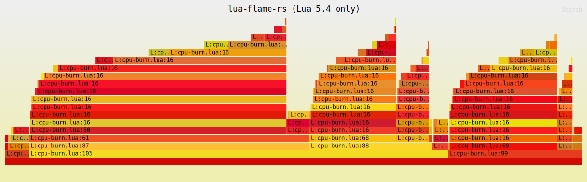
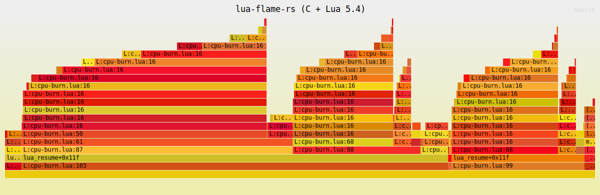

# lua-flame-rs

`lua-flame-rs` is an eBPF-based CPU flame graph profiler for **Lua 5.2, 5.3,
and 5.4**. It profiles a running process by PID, walks the Lua `CallInfo`
linked list to recover interpreter frames as `source:line`, and can combine
native C frames with Lua frames in the same flame graph.

The profiler supports x86_64 and aarch64 Linux. Its user-space component is
written in Rust, while CPU sampling and Lua stack walking run in eBPF. A
single profiler binary handles all three Lua versions — version-dependent
runtime offsets are detected at attach time and passed into the BPF program
through `.rodata` config.

### Lua-only flame graph



This graph was generated from the bundled `tests/cpu-burn.lua` workload using
the default Lua-only output mode.

### C and Lua flame graph



This graph was generated from the same workload with `--include-c-stacks`, so
native C frames are shown together with the Lua source frames.

## Features

- Profiles a running Lua 5.2 / 5.3 / 5.4 process by PID.
- Auto-detects the Lua version (sentinel symbols, then file-name substring);
  `--lua-version` and `--lua-module` overrides cover stripped or statically
  linked runtimes.
- Captures CPU samples with `perf_event` and eBPF.
- Resolves Lua frames as `L:<chunkname>:<line>` using `Proto->lineinfo` (and
  `abslineinfo` on 5.4).
- Distinguishes Lua closures, C closures, and light C functions.
- Unwinds native C frames from ELF DWARF CFI without requiring frame pointers.
- Interleaves Lua frames with native C frames for mixed-stack analysis.
- Writes folded stacks and an SVG flame graph.

## Quick start

Before running the profiler, the target machine must provide:

- Linux kernel >= 5.13 with eBPF, uprobes, perf events, and BTF enabled.
- Readable kernel BTF at `/sys/kernel/btf/vmlinux`.
- `kernel.perf_event_paranoid <= 1`.
- A running process with Lua 5.2, 5.3, or 5.4 loaded — linked against the
  matching `liblua5.X.so` or statically linked into the executable. LuaJIT is
  not supported.
- `root` privileges, or the equivalent eBPF, perf-event, uprobe, and
  process-access permissions required by the host kernel.

After building from source, profile a Lua process for 10 seconds with:

```sh
# Confirm that perf-event sampling is allowed.
cat /proc/sys/kernel/perf_event_paranoid

# Run this only when the value is greater than 1.
echo 1 | sudo tee /proc/sys/kernel/perf_event_paranoid

sudo ./target/release/lua-flame-rs -p <PID> -d 10 -o folded.txt
```

The command writes:

- `folded.txt`: folded stack output.
- `folded.svg`: rendered flame graph.

Lua-only output is the default. Add `--include-c-stacks` to also include
native C frames in the same flame graph:

```sh
sudo ./target/release/lua-flame-rs -p <PID> --include-c-stacks -d 10 -o mixed.txt
```

Open the generated SVG in a browser to inspect the result.

## Build from source

Source builds require Rust >= 1.77, Clang/LLVM for compiling the eBPF program,
and the native C development toolchain used by `libbpf`.

Install the build dependencies on Debian/Ubuntu with:

```sh
sudo apt install autoconf automake autopoint bison flex gawk \
  build-essential clang llvm pkg-config \
  libelf-dev libbpf-dev zlib1g-dev \
  liblua5.4-dev        # or liblua5.3-dev / liblua5.2-dev for the demo workload
```

### x86_64

The checked-in `bpf/vmlinux.h` targets x86_64, so the release binary can be
built directly:

```sh
cargo build --locked --release
```

The resulting binary is `target/release/lua-flame-rs`.

### aarch64

The build script automatically selects the checked-in minimal arm64 BPF UAPI
header at `bpf/arm64/vmlinux.h`, so no build-host BTF or `bpftool` is required:

```sh
cargo build --locked --release
```

The build script compiles `bpf/profile.bpf.c` with Clang and generates the Rust
libbpf skeleton at compile time through `libbpf-cargo`.

## Architecture

```text
target process (lua5.X / liblua5.X.so embedder)
   |
   |  uprobe on lua_resume / lua_pcallk / lua_callk   -> capture lua_State* per tid
   |  uretprobe on lua_resume/lua_pcallk/lua_callk/lua_yieldk  -> drop lua_State* per tid
   |  perf-event CPU clock @ N Hz         -> on each sample:
   |      - registers + user stack bytes  -> offline native unwind input
   |      - bpf_get_stack()               -> fallback native IPs
   |      - walk CallInfo list            -> savedpc -> source line
   |
   v  perf buffer
+----------------------------------------------------------+
| Rust user space                                          |
|   libbpf-rs  : load skeleton, attach uprobe/perf-event   |
|   object     : find lua_resume/pcallk/callk/yieldk ELF   |
|                offsets + detect Lua version              |
|   framehop   : unwind native frames from ELF DWARF CFI   |
|   blazesym   : resolve native IPs -> C symbol names      |
|   inferno    : folded stacks -> flame graph SVG          |
+----------------------------------------------------------+
```

Native unwinding runs in user space. The eBPF program captures registers and a
bounded user-stack snapshot, then `framehop` applies the target modules' ELF
`.eh_frame` or `.debug_frame` data. If DWARF unwinding cannot recover a usable
stack, that sample falls back to the native IPs collected by `bpf_get_stack()`.

Lua frames do not depend on DWARF. The eBPF stack walker reads the
`lua_State` / `CallInfo` / `LClosure` / `Proto` runtime structures directly,
converts `savedpc` into a bytecode index, and decodes per-instruction line
data from `Proto->lineinfo` (delta-encoded + `abslineinfo` on 5.4; plain
`int[]` on 5.2/5.3). All version-dependent offsets are baked into the BPF
program via `.rodata`; see [`docs/multi-version.md`](docs/multi-version.md)
for the offset tables and how they were validated.

## Usage reference

The only required flag is `-p/--pid`:

```sh
sudo ./target/release/lua-flame-rs -p 1234
```

By default the profiler samples at 99 Hz, runs until Ctrl-C, emits only Lua
frames, writes folded stacks to `folded.txt`, and writes the flame graph to
`folded.svg`.

Example bounded capture:

```sh
sudo ./target/release/lua-flame-rs -p 1234 -F 99 -d 10 -o folded.txt
```

| Flag | Description |
|---|---|
| `-p, --pid <PID>` | Target process PID. Required. |
| `-F, --frequency <N>` | Sampling frequency in Hz. Default: `99`. |
| `-d, --duration <S>` | Capture duration in seconds. `0` means until Ctrl-C. Default: `0`. |
| `--include-c-stacks` | Include native C frames in addition to Lua frames. |
| `--lua-version <5.2\|5.3\|5.4>` | Override Lua-version auto-detection. Needed when the target is stripped or LTO-gc'd so version sentinels are gone. |
| `--lua-module <PATH>` | Override Lua-module auto-discovery. Only needed when auto-discovery can't decide (multiple Lua modules loaded, or a non-obvious path); the main executable is scanned automatically so statically linked Lua needs no flag. The ELF must export at least one of `lua_resume` / `lua_pcallk` / `lua_callk`. |
| `-o, --output <FILE>` | Folded output path. The SVG is written next to it. |

## Demo workload

If no Lua process is available to profile, use the bundled test harness.
It mimics the nginx/OpenResty model where each request enters Lua through
`lua_resume`. It builds against any of Lua 5.2, 5.3, or 5.4:

```sh
# Build the C harness against whichever Lua you have installed.
# Lua 5.4:
cc -O2 tests/harness.c -o /tmp/lua-harness \
   -I/usr/include/lua5.4 \
   -llua5.4 -lm -ldl -Wl,-rpath=/usr/lib/x86_64-linux-gnu
# Lua 5.3:
cc -O2 tests/harness.c -o /tmp/lua-harness \
   -I/usr/include/lua5.3 \
   -llua5.3 -lm -ldl -Wl,-rpath=/usr/lib/x86_64-linux-gnu
# Lua 5.2:
cc -O2 tests/harness.c -o /tmp/lua-harness \
   -I/usr/include/lua5.2 \
   -llua5.2 -lm -ldl -Wl,-rpath=/usr/lib/x86_64-linux-gnu

# Start the workload.
/tmp/lua-harness tests/cpu-burn.lua &
HPID=$!

# Profile Lua frames for 8 seconds. (Version is auto-detected; if you
# stripped the binary, add --lua-version 5.4 / 5.3 / 5.2.)
sudo ./target/release/lua-flame-rs -p $HPID -d 8 -o folded.txt

# Include native C frames in the same flame graph.
sudo ./target/release/lua-flame-rs \
  -p $HPID --include-c-stacks -d 8 -o mixed.txt
```

The workload accepts environment variables for tuning the flame graph's
shape (heavier recursion, wider loops, etc.):

| Variable | Default | Effect |
|---|---|---|
| `LUA_FLAME_RS_HARNESS_ITERS` | `1000000000` | Number of "requests" (resume cycles) the harness runs before exiting. |
| `LUA_FLAME_RS_WORK_ITERS` | `200000` | Outer hot-loop iterations per request. |
| `LUA_FLAME_RS_FIB_N` | `15` | Recursion depth for `fib`. Raise for deeper Lua stacks. |
| `LUA_FLAME_RS_SUM_N` | `40` | Iterations of the arithmetic-heavy `sum_squares` loop. |
| `LUA_FLAME_RS_SCAN_N` | `24` | Outer iterations in `parse_payload`. |
| `LUA_FLAME_RS_ROUND_N` | `6` | Inner iterations in `rotate_seed`. |

Lua source lines come from Lua runtime metadata, so the target Lua does not
need to be built with `-g` for Lua stack collection. Debug symbols are useful
only when more native symbol detail is needed in mixed stacks. Native
unwinding uses `.eh_frame` or `.debug_frame`, which standard Linux toolchains
normally emit even for optimized builds that omit frame pointers.

If the Lua bytecode was *loaded* with debug line info stripped (e.g.
`luac -s`, or `string.dump(..., true)`), there is no per-instruction line
data for the profiler to read — those frames fall back to the function's
`linedefined`, shown as `L:<chunk>:<def line>` rather than the live sample's
line. This is a property of the bytecode, not of the profiler; load the
chunk without stripping (`luac`, or `string.dump(..., false)`) to recover
per-instruction lines.

## Limitations

- **Supported runtimes**: PUC Lua 5.2, 5.3, 5.4. LuaJIT and Lua 5.1 / 5.5+ are
  not supported (LuaJIT is explicitly rejected at attach time — its internals
  are entirely different).
- **ABI**: the baked-in offsets target the default 64-bit ABI on Linux x86_64
  / aarch64 (`sizeof(long)==8`, `sizeof(void*)==8`, `Instruction` = 32-bit). A
  build compiled with `-DLUA_32BITS` or other non-default options will need
  updated offsets — see `tests/offsets.c` for the validation harness.
- **Endianness**: little-endian only (x86_64 / aarch64 LE).
- The Lua `CallInfo` walk is bounded by `MAX_LUA_DEPTH` (32) to keep the eBPF
  verifier complexity manageable.
- The Lua 5.4 line resolver walks `Proto->lineinfo` forward from pc 0, bounded
  by `sizelineinfo`; very large functions pay an O(pc) cost per sample.
- `lua_pcallk` / `lua_callk` / `lua_yieldk` are looked up best-effort: at
  least one of `lua_resume` / `lua_pcallk` / `lua_callk` must be present to
  attach; whichever are missing degrade coroutine yield-aware re-entrancy
  tracking.
- **Stripped / statically linked targets**: version detection falls back to
  the file-name substring, and finally to `--lua-version`. If the binary is
  fully stripped of *all* of `lua_resume` / `lua_pcallk` / `lua_callk`, there
  is nothing to uprobe — at least one Lua entry-point symbol must survive
  the link (LTO + `--gc-sections` keeps whichever the host actually calls).
